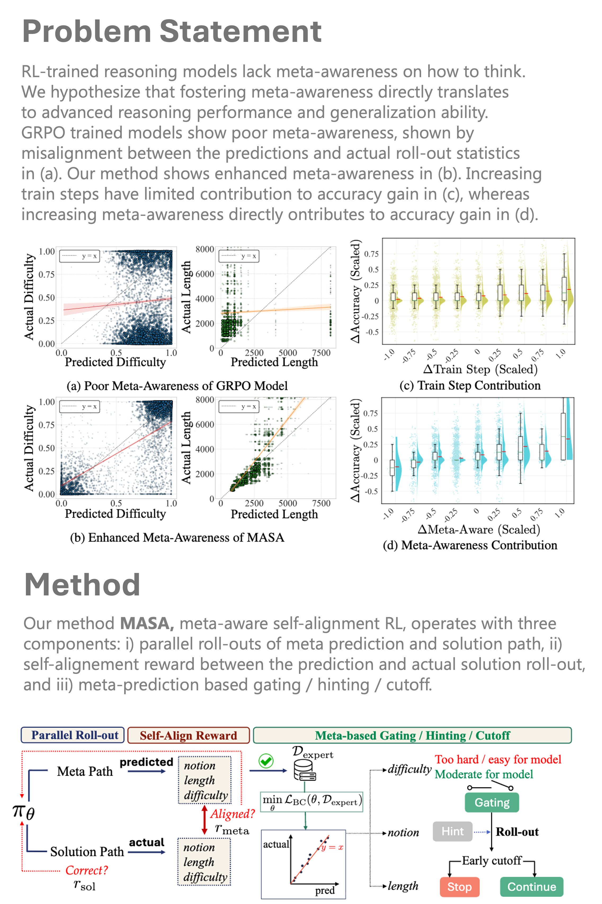

## Meta-Awareness Enhances Reasoning Models: Self-Alignment Reinforcement Learning
### 📖 [Paper]() | ✨ [Project page]()

> #### Authors &emsp;&emsp; [Yoonjeon Kim](https://akatigre.github.io/)<sup>1&#42;</sup>, [Doohyuk Jang](https://jadohu.github.io/)<sup>1&#42;</sup>, [Eunho Yang](https://scholar.google.com/citations?user=UWO1mloAAAAJ&hl=en)<sup><sup>1,2&dagger;</sup> <br> <sub> &emsp;&emsp;&emsp;&emsp;&emsp;&emsp;&emsp;&emsp; <sup>1</sup>KAIST, <sup>2</sup>AITRICS</sub> <br> <sub> &emsp;&emsp;&emsp;&emsp;&emsp;&emsp;&emsp;&emsp; <sup>&#42;</sup>Equal Contribution, <sup>&dagger;</sup>Corresponding author</sub>



> #### 🔆 Abstract
> *Recent studies on reasoning models explore the meta-awareness of language models, the ability to determine `how to think' by itself. We argue that large reasoning models lack this meta-awareness property by proving severe misalignment between true roll-outs and predicted meta information. We hypothesize that the alignment of meta prediction and true roll-outs directly leads to significant performance gain. To verify this hypothesis, we design a training pipeline that boosts ***Meta-Awareness via Self-Alignment (MASA)***. Unlike prior approaches, our method requires no external datasets, auxiliary models, or human-crafted reasoning pipelines but leverages ***self-generated reasoning signals to train meta-awareness***. Meta-awareness enables efficient training through prediction-based gating and cutoff, with behavior cloning on expert meta-trajectories ensuring reliable meta-predictions. The results are inspiring: our strategy yields significant improvements in both accuracy and training efficiency on in-domain tasks and shows strong generalization to out-of-domain benchmarks. More specifically, our method can speed up GRPO training by over 1.28x to reach the same performance, and achieve a 19.3% gain in accuracy on AIME25, and a 6.2% average gain over six mathematics benchmarks. Aided by the enhanced meta-cognitive ability, our approach benefits generalization in out-of-domain benchmarks, gaining an additional 3.87% in GPQA-Diamond, and an overall 2.08% accuracy gain over 13 benchmarks encompassing logical, scientific, and coding domains.*
---

### 🔥 To do
* [x] integration into VeRL
* [x] Evaluation on mathematical benchmarks
* [x] Evaluation on logical / scientific / coding benchmarks

---
### 📚 Citation
```bibtex

```
