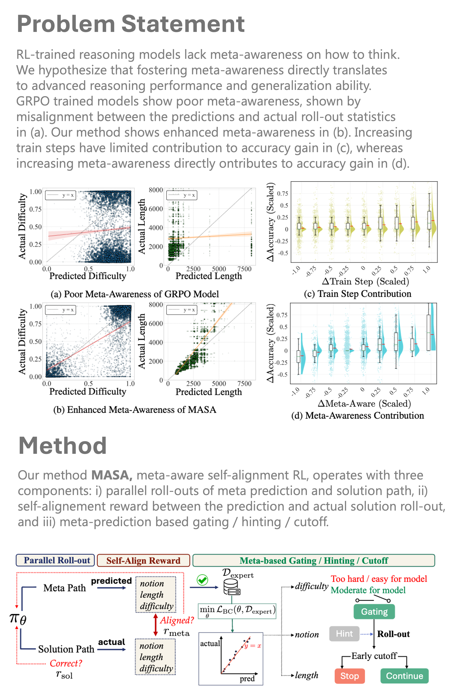

## Verifying Meta-Awareness via Predictive Rewards in Reasoning Models

### 🎉 Accepted to ICML 2026

### 📖 [Paper](https://drive.google.com/file/d/1n3cKn0jOWSnvmLhdUh2AxT3j3nbNnxVi/view?usp=sharing) | 🤗 [Checkpoints](https://huggingface.co/collections/jadohu/masa)

> #### Authors &emsp;&emsp; [Yoonjeon Kim](https://akatigre.github.io/)<sup>1&#42;</sup>, [Doohyuk Jang](https://jadohu.github.io/)<sup>1&#42;</sup>, [Eunho Yang](https://scholar.google.com/citations?user=UWO1mloAAAAJ&hl=en)<sup><sup>1,2&dagger;</sup> <br> <sub> &emsp;&emsp;&emsp;&emsp;&emsp;&emsp;&emsp;&emsp; <sup>1</sup>KAIST, <sup>2</sup>AITRICS</sub> <br> <sub> &emsp;&emsp;&emsp;&emsp;&emsp;&emsp;&emsp;&emsp; <sup>&#42;</sup>Equal Contribution, <sup>&dagger;</sup>Corresponding author</sub>



> #### 🔆 Abstract
> *Recent research on reasoning models explores the meta-awareness of language models, including their ability to determine optimal thinking duration, recognize knowledge boundaries, and structure concept-level thinking. While current large reasoning models depend solely on answer-based verification, we show that adding meta-awareness objectives leads to significant performance gains over models without such meta-knowledge. **MAPR** (Meta-Awareness via
Predictive Reward)  utilizes a self-generated task of predicting rollout statistics - specifically length, pass-rate, and concepts used - allowing for verification against the actual statistics. Furthermore, by leveraging this self-predictive capability, the model can regulate its reasoning behavior by i) filtering out trivial or unsolvable prompts, ii) reducing lengthy generations that tend to be incorrect, and iii) generating hints relevant to the problem. The results are inspiring: **MAPR** yields significant improvements in both accuracy and training efficiency on various reasoning benchmarks. More specifically, our method can speed up GRPO training by over 1.28$\times$ to reach the same performance, and achieve 83.18% gain in accuracy on AIME25, and a 13.04% average gain over six mathematics benchmarks.*
---

### 🔥 To do
* [x] Integration into VeRL
* [x] MASA with dapo algorithm
* [x] ~~Training pipeline of MASA~~
* [x] ~~Evaluation on mathematical benchmarks~~
* [x] ~~Evaluation on logical / scientific / coding benchmarks~~

### 🚀 Installation
We highly recommend to use uv environment for fast environment building.
Check how to install from [uv installation](https://docs.astral.sh/uv/getting-started/installation/).
```
uv venv --python 3.12
source .venv/bin/activate
uv pip install torch==2.7.0
uv pip install --no-build-isolation -e . 
uv pip install latex2sympy2_extended fire tensordict pysnooper hydra-core wandb
uv pip install flash-attn==2.8.3 --no-build-isolation
```

## 🚀 Run Full Evaluation in One line
You can run **inference**, **evaluation**, and **score calculation** all at once using the following command:
```
bash eval.sh <MODEL_NAME> <DOMAIN [math|science|logic|coding]> <NUM_GPUS>
```

### ⚠️ Note:
- For coding benchmarks, **only MBPP** is currently supported, since **coding evaluation environments vary greatly across benchmarks**.
- For other benchmarks, please use their **official evaluation implementations**.

## 🔍 Fine-Grained Execution by Stage
1. Inference
    ```
    python3 eval/inference.py \
        --model_path MODEL_NAME_OR_PATH \
        --dataset DATSET_NAME \
        --temperature TEMPERATURE \
        --tp TENSOR_PARALLEL_SIZE \
        --max_model_len MAX_MODEL_LEN \
        --max_new_token MAX_NEW_TOKEN \
        --dtype MODEL_DTYPE \
        --output_dir OUTPUT_DIR \
        --n NUMBER_OF_SAMPLE_PER_PROMPT
    ```
    **Supported Datasets:**

    ```["math", "amc23", "aime2025", "math500", "minerva", "olympiad_math", "aime2024", "rbench", "gpqa_diamond", "arc_challenge", "scibench", "AR-LSAT", "FOLIO", "LogicalDeduction", "ProntoQA", "ProofWriter", "MBPP"]```

    You can also integrate your custom dataset by following the provided data preprocessing code.

---
2. Evaluation
    ```
    python3 eval/eval.py \
        --response_path INFERENCE_OUTPUT_PATH \
        --eval_path OUTPUT_EVAL_RESULT_PATH
    ```
    This script evaluates the **correctness** of each response stored in the given ```response_path``` directory.

---
3. Score Calculation
    ```
    python3 eval/calc_passk.py \
        --eval_path EVAL_RESULT_PATH \
        --k COMMA_SEPARATED_K_VALUES
    ```
    This script computes the **pass@k** metrics (e.g., pass@1, pass@5, pass@10) based on your evaluation results.

### 📈 Training Your Own Model with MASA + GRPO algorithm
```
wandb login # login to your wandb account
bash train_masagrpo.sh # To run our MASA with GRPO algotithm
bash train_grpo.sh # To run baseline GRPO algorithm without MASA
```

The training configurations (NGPUS, OUTPUT_DIR, BASE_MODEL, BASE_DIR) could be modified in the scripts.
The training of 8B model is executed with 8 x H100, which takes about 1-2 days to reach a single epoch (314 steps with batch size 128).

If out of memory error occurs, adjust the following values.

- `actor_rollout_ref.actor.ppo_max_token_len_per_gpu=36000`
- `actor_rollout_ref.ref.log_prob_max_token_len_per_gpu=96000`
- `actor_rollout_ref.rollout.log_prob_max_token_len_per_gpu=96000`


For more performance acceleration, refer to this verl document page [Performance Tuning Guide](https://verl.readthedocs.io/en/latest/perf/perf_tuning.html).

### ⏳ Preprocess Your Custom Dataset for Training or Evaluation!
```
python3 data_preprocess.py --dataset_name HF_DATASET_NAME
```

### 🙏 Acknowledgements
This repository builds upon and references the following open-source projects:
- [volcengine/verl](https://github.com/volcengine/verl)
- [teacherpeterpan/LogicLLM](https://github.com/teacherpeterpan/Logic-LLM)
- [deepseek-ai/DeepSeek-Coder](https://github.com/deepseek-ai/DeepSeek-Coder)

We sincerely thank the authors of these repositories for their valuable contributions to the community.

---
### 📚 Citation
```bibtex
@article{kim2025meta,
  title={Meta-Awareness Enhances Reasoning Models: Self-Alignment Reinforcement Learning},
  author={Kim, Yoonjeon and Jang, Doohyuk and Yang, Eunho},
  journal={arXiv preprint arXiv:2510.03259},
  year={2025}
}
```
